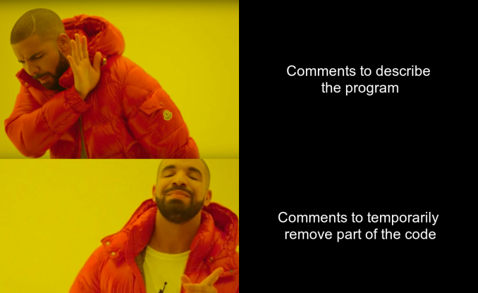
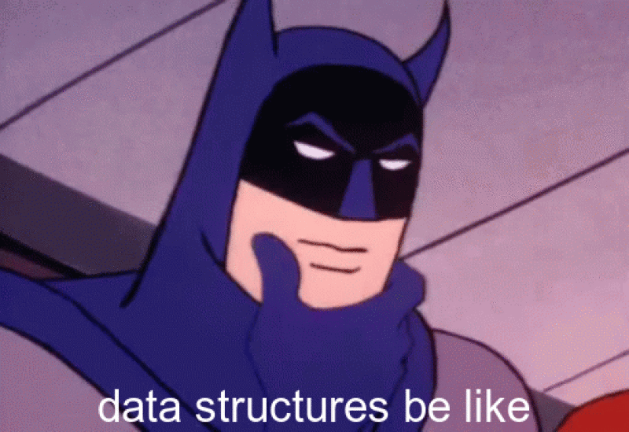

```{r setup, include=FALSE}
knitr::opts_chunk$set(echo = TRUE)
```

## My Meme

My meme is using the Drake template, but with a slight twist. As I am using a
dark theme for this website, I have amended the meme to have a dark background
and white text - matching the theme of the website. Inspiration came from Google,
when you search for computer science memes.



    ```{r file='meme.R', eval=FALSE}
    ```

## My Animated GIF

This is my animated GIF, which is based off the cartoon batman - stroking his chin.
The inspiration came from tenor and is based off the same GIF and inspired from 
my dislike for computer science data structures!



    ```{r file='animation.R', eval=FALSE}
    ```

## CSS

```{css}

/* Import my preferred font */
@import url('https://fonts.googleapis.com/css2?family=Montserrat:ital,wght@0,100;0,200;0,300;0,400;0,500;0,600;0,700;0,800;0,900;1,100;1,200;1,300;1,400;1,500;1,600;1,700;1,800;1,900&display=swap');

/* Apply universal styles */
body {
    font-family: 'Montserrat', sans-serif;
    background-color: #000;
    align-items:center;
    color: #FFF;
}

h1, h2 {
  font-weight: bold;
}

h3 {
  font-style: italic;
}

h2 {
    border-bottom: 5px solid #C71585;
    border-radius: 50%;
    color: #FFF;
    text-align: center;
    padding-top: 5px;
    width: fit-content;
    margin: auto;
    padding: 5px 20px;
}
pre.css {
  margin-top: 2%;
}

h4 {
  border-bottom: 5px solid #C71585;
  border-radius: 4px;
  padding-bottom: 5px;
}

/* Align all items centre */
p {
  text-align: center;
  padding: 5px 5px;
}

/* To give the meme and gif the same curves as code blocks */
img {
  border-radius: 4px; 
}

/* Change code block colours to match overall dark theme */
code.hljs {
    color: #FFF;
}

pre, pre:not([class]) {
  background-color: #000;
}!important;


```
